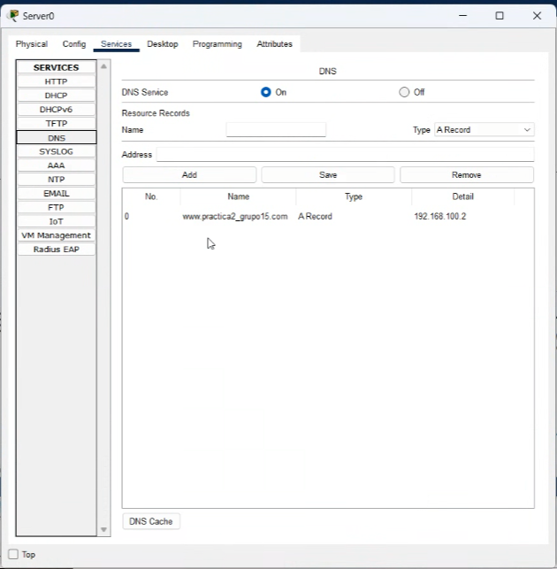
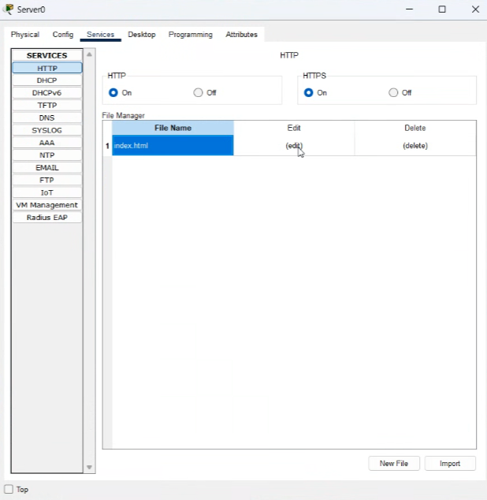
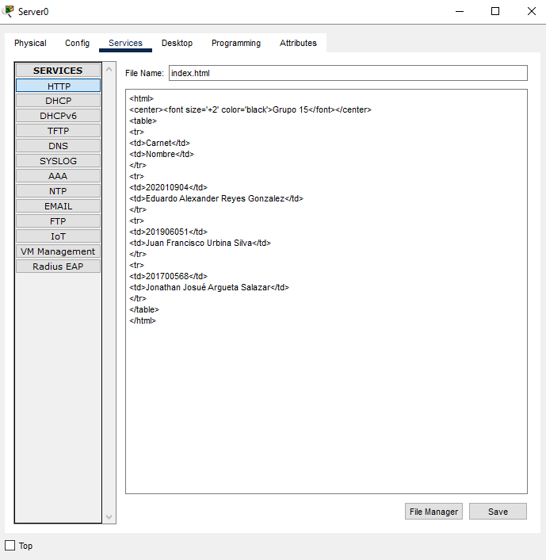
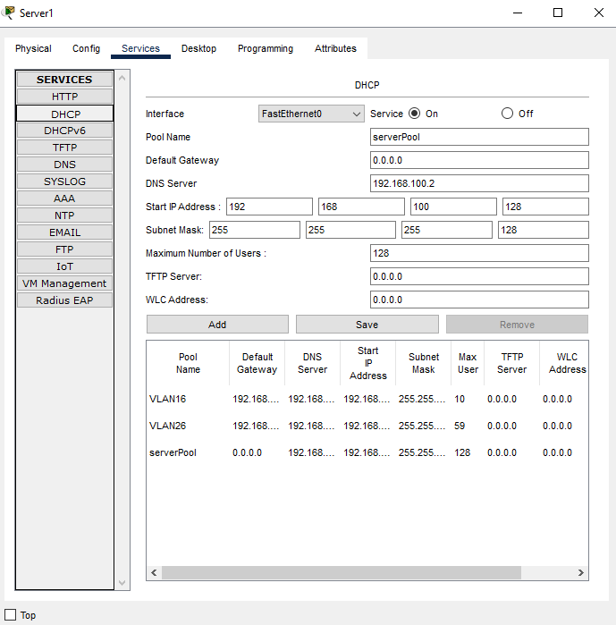

# Manual Técnico Práctica 2

## Direcciones IP

| Usado       | COLOR   | VLAN | HOST | Direccion          |
| ---         | ---     | ---  | ---  | ---                |
| Admin       | AZUL    | 16   | 10   | 192.168.15.0/28    |
| Estudiantes | ROSA    | 26   | 60   | 192.168.15.0/26    |
| Piso 1      |         |      | 60   | 192.168.15.128     |
| Piso 2      |         |      | 60   | 192.168.15.192     |
| Web Server  | VERDE   | 36   |      | 192.168.100.0/25   |
| DHCP Server | Naranja | 46   |      | 192.168.100.128/25 |


* Redes utilizadas
| UTILIZADO  | RED         | PRIMERA         |  BROADCAST       |
| ---        | ---         | ---             |  ---             |
| LACP1      | 10.0.15.0   | 10.0.15.1       |  10.0.15.3       |
| LACP2      | 10.0.15.4   | 10.0.15.5       |  10.0.15.7       |
| LACP3      | 10.0.15.8   | 10.0.15.9       |  10.0.15.11      |
| R1 VRRP    | 10.0.15.12  | 10.0.15.13      |  10.0.15.15      |
| R2 VRRP    | 10.0.15.16  | 10.0.15.17      |  10.0.15.19      |
| ROUTER P2  | 10.0.15.20  | 10.0.15.21      |  10.0.15.23      |
| ROUTER P3  | 10.0.15.24  | 10.0.15.25      |  10.0.15.27      |


## Comandos Utilizados

```sh
## Switch0

enable
conf ter
vlan 16
name ADMIN
vlan 26
name ESTUDIANTES
exit
interface fa0/11
switchport mode access
switchport access vlan 16
exit
interface fa0/12
switchport mode access
switchport access vlan 26
exit
interface range fa0/1-10
switchport mode trunk
switchport trunk allowed vlan all
exit
interface range fa0/13-24
switchport mode trunk
switchport trunk allowed vlan all
exit
do write
```


```sh
## Multilayer Switch 3

enable
conf ter
ip routing
interface range fa0/1-4
no switchport
channel-protocol lacp
channel-group 1 mode active
exit
interface port-channel 1
ip address 10.0.15.1 255.255.255.252
exit
Interface fa0/10
no switchport
ip address 10.0.15.21 255.255.255.252
exit
router eigrp 1
network 10.0.15.0 0.0.0.3
network 10.0.15.20 0.0.0.3
no auto-summary
exit
do write


```sh
## Multilayer Switch 0

enable
conf ter
ip routing
interface range fa0/5-8
no switchport
channel-protocol lacp
channel-group 2 mode active
exit
interface port-channel 2
ip address 10.0.15.5 255.255.255.252
exit
interface fa0/10
no switchport
ip address 10.0.15.25 255.255.255.252
exit
router eigrp 1
network 10.0.15.4 0.0.0.3
network 10.0.15.24 0.0.0.3
no auto-summary
exit
do write
```


```sh
## Multilayer Switch 2

enable
conf ter
ip routing
interface range fa0/9-12
no switchport
channel-protocol lacp
channel-group 3 mode active
exit
interface port-channel 3
ip address 10.0.15.9 255.255.255.252
exit
router eigrp 1
network 10.0.15.8 0.0.0.3
no auto-summary
exit
do write
```


```sh
## Multilayer Switch 4

enable
conf ter
ip routing
interface range fa0/1-4
no switchport
channel-protocol lacp
channel-group 1 mode active
exit
interface port-channel 1
ip address 10.0.15.2 255.255.255.252
exit
interface range fa0/5-8
no switchport
channel-protocol lacp
channel-group 2 mode active
exit
interface port-channel 2
ip address 10.0.15.6 255.255.255.252
exit
interface range fa0/9-12
no switchport
channel-protocol lacp
channel-group 3 mode active
exit
interface port-channel 3
ip address 10.0.15.10 255.255.255.252
exit

interface gi0/2
no switchport
ip address 10.0.15.14 255.255.255.252
no shutdown
exit
interface gi0/1
no switchport
ip address 10.0.15.18 255.255.255.252
no shutdown
exit
router eigrp 1
network 10.0.15.0 0.0.0.3
network 10.0.15.4 0.0.0.3
network 10.0.15.8 0.0.0.3
network 10.0.15.12 0.0.0.3
network 10.0.15.16 0.0.0.3
no auto-summary
exit
do write
```


```sh
# VRRP
## Router1

enable
configure terminal
hostname R1
interface gigabitEthernet 0/0
no shutdown
exit
interface gigabitEthernet 0/1
no shutdown
ip address 10.0.15.13 255.255.255.252
exit

interface gigabitEthernet 0/0.16
encapsulation dot1Q 16
ip address 192.168.15.2 255.255.255.240
no shutdown
exit

interface gigabitEthernet 0/0.26
encapsulation dot1Q 26
ip address 192.168.15.66 255.255.255.192
no shutdown
exit

interface gigabitEthernet 0/0.16
standby 16 ip 192.168.15.1
standby 16 priority 100
standby 16 preempt
exit
interface gigabitEthernet 0/0.26
standby 26 ip 192.168.15.65
standby 26 priority 100
standby 26 preempt
exit

router eigrp 1
network 192.168.15.64 0.0.0.63
network 192.168.15.0 0.0.0.15
network 10.0.15.12 0.0.0.3
no auto-summary
exit
do write

## ROUTER 2
enable
configure terminal
interface gigabitEthernet 0/0
no shutdown
exit
interface gigabitEthernet 0/1
no shutdown
ip address 10.0.15.17 255.255.255.252
exit
interface gigabitEthernet 0/0.16
encapsulation dot1Q 16
ip address 192.168.15.3 255.255.255.240
no shutdown
exit
interface gigabitEthernet 0/0.26
encapsulation dot1Q 26
ip address 192.168.15.67 255.255.255.192
no shutdown
exit
interface gigabitEthernet 0/0.16
standby 16 ip 192.168.15.1
standby 16 priority 110
standby 16 preempt
exit
interface gigabitEthernet 0/0.26
standby 26 ip 192.168.15.65
standby 26 priority 110
standby 26 preempt
exit
router eigrp 1
network 192.168.15.64 0.0.0.63
network 192.168.15.0 0.0.0.15
network 10.0.15.16 0.0.0.3
no auto-summary
exit
do write
```

## Configuración DNS







## DHCP


