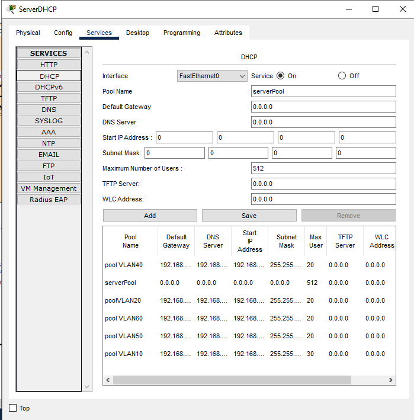
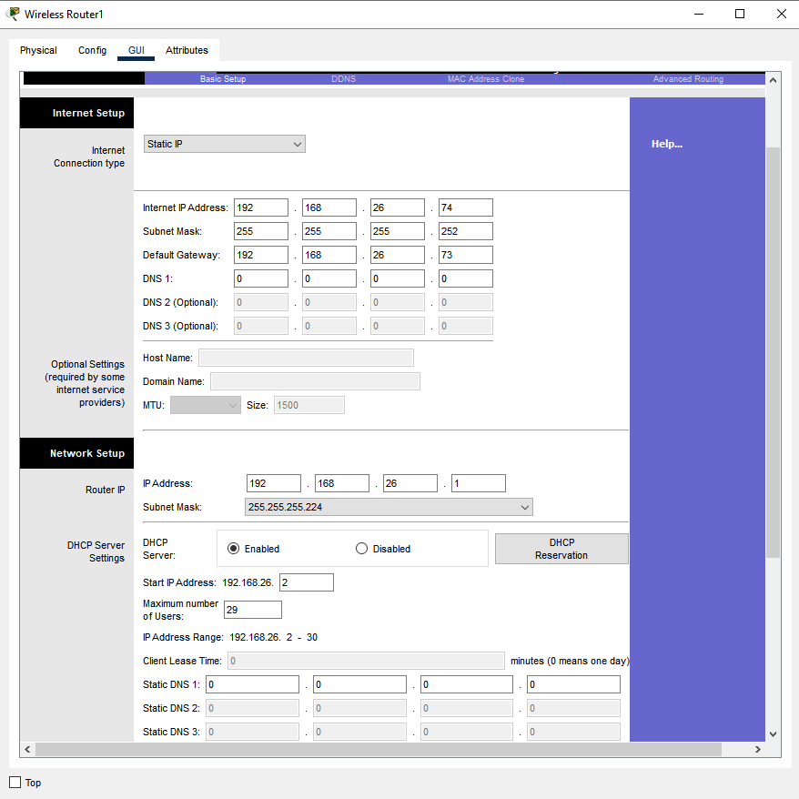
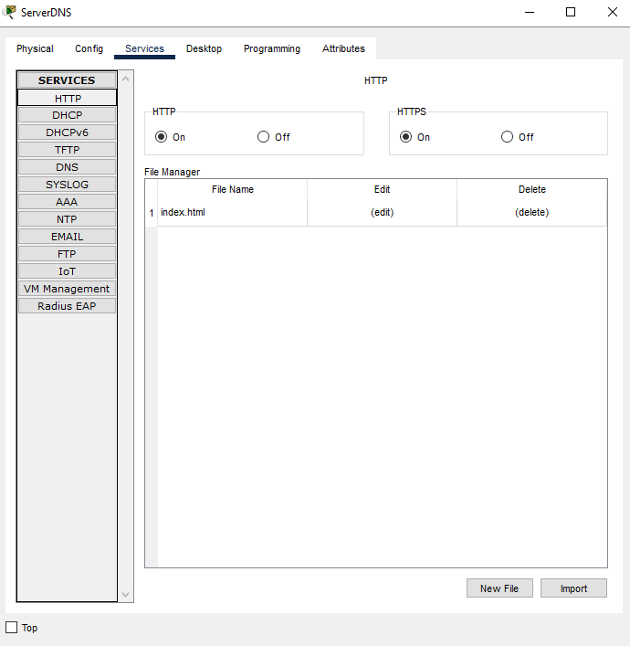
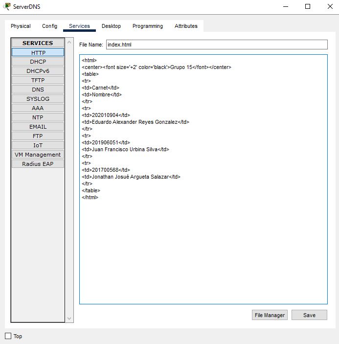

# Manual Técnico
## Topología

### Completa

[](./img/TopologiaCompleta.png)

### Telecom 1

[](./img/Telecom.png)

### Redes Nacionales

[](./img/RedesNacionales.png)

### Conexiones Futuras

[](./img/ConexionesFuturas.png)

## Direcciones

### Telecom 1
### Redes Nacionales

| UTILIZADAS | RED | PRIMERA | ULTIMA | BROADCAST | MASCARA | WILDCARD | CIDR |
| --- | --- | --- | --- | --- | --- | --- | --- |
| VLAN 30 | 192.168.26.0 | 192.168.26.1 | 192.168.26.30 | 192.168.26.31 | 255.255.255.224 | 0.0.0.31 | /27 | 
| VLAN 40 | 192.168.26.32 | 192.168.26.33 | 192.168.26.62 | 192.168.26.63 | 255.255.255.224 | 0.0.0.31 | /27 | 
| MS2.1 - MS2.2 | 192.168.26.64 | 192.168.26.65 | 192.168.26.66 | 192.168.26.67 | 255.255.255.252 | 0.0.0.3 | /30 | 
| MS2.2 - MS2.4 | 192.168.26.68 | 192.168.26.69 | 192.168.26.70 | 192.168.26.71 | 255.255.255.252 | 0.0.0.3 | /30 | 
| MS2.4 - Rinalambrico | 192.168.26.72 | 192.168.26.73 | 192.168.26.74 | 192.168.26.75 | 255.255.255.252 | 0.0.0.3 | /30 | 
| MS2.1 - MS2.3 | 192.168.26.76 | 192.168.26.77 | 192.168.26.78 | 192.168.26.79 | 255.255.255.252 | 0.0.0.3 | /30 | 
| MS2.3 - R2.1 | 192.168.26.80 | 192.168.26.81 | 192.168.26.82 | 192.168.26.83 | 255.255.255.252 | 0.0.0.3 | /30 | 
| S2.1 - MS2.1 | 192.168.26.84 | 192.168.26.85 | 192.168.26.86 | 192.168.26.87 | 255.255.255.252 | 0.0.0.3 | /30 | 


### Conexiones Futuras

| UTILZADAS | RED	| PRIMERA |	ULTIMA | BROADCAST |
| --- | --- | --- | --- | --- | 
| VLAN 50 | 192.168.36.0 | 192.168.36.1 | 192.168.36.62 | 192.168.36.63 |
| VLAN 60 | 192.168.36.64 | 192.168.36.65 | 192.168.36.126 | 192.168.36.127 |
| R3.1 | 192.168.36.128 | 192.168.36.129 | 192.168.36.130 | 192.168.36.131 |
| R3.2 | 192.168.36.132 | 192.168.36.133 | 192.168.36.134 | 192.168.36.135 |
| LACP5 | 192.168.36.136 | 192.168.36.137 | 192.168.36.138 | 192.168.36.139 |
| LACP6 | 192.168.36.140 | 192.168.36.141 | 192.168.36.142 | 192.168.36.143 |
| MS3.1 | 192.168.36.144 | 192.168.36.145 | 192.168.36.146 | 192.168.36.147 |


## Comandos Utilizados 

### Core

#### Configuraciones

```sh
# Multilayer Switch0

interface GigabitEthernet1/0/3
no switchport
ip address 192.168.16.90 255.255.255.252
ip helper-address 192.168.16.50
ip helper-address 192.168.36.68
duplex auto
speed auto
exit

interface GigabitEthernet1/1/1
no switchport
ip address 172.15.20.1 255.255.255.252
ip helper-address 192.168.16.50
ip helper-address 192.168.36.68
exit

interface GigabitEthernet1/1/3
no switchport
ip address 172.15.10.1 255.255.255.252
ip helper-address 192.168.16.50
ip helper-address 192.168.36.68
exit

router eigrp 100
redistribute bgp 65001 metric 10000 100 255 1 1500 
network 192.168.16.88 0.0.0.3
network 172.15.10.0 0.0.0.3
network 172.15.20.0 0.0.0.3
auto-summary
exit

router bgp 65001
bgp log-neighbor-changes
no synchronization
neighbor 172.15.10.2 remote-as 65002
neighbor 172.15.20.2 remote-as 65003
network 172.15.10.0 mask 255.255.255.252
network 172.15.20.0 mask 255.255.255.252
network 192.168.16.88 mask 255.255.255.252
redistribute eigrp 100 
exit

do wr

# Multilayer Switch2

interface GigabitEthernet1/0/3
no switchport
ip address 192.168.36.146 255.255.255.252
duplex auto
speed auto
exit

interface GigabitEthernet1/1/1
no switchport
ip address 172.15.20.2 255.255.255.252
exit

interface GigabitEthernet1/1/2
no switchport
ip address 172.15.30.2 255.255.255.252
exit

router ospf 3
log-adjacency-changes
redistribute bgp 65003 subnets 
network 192.168.36.144 0.0.0.3 area 0
network 172.15.30.0 0.0.0.255 area 0
exit

router bgp 65003
bgp log-neighbor-changes
no synchronization
neighbor 172.15.20.1 remote-as 65001
neighbor 172.15.30.1 remote-as 65002
network 172.15.30.0 mask 255.255.255.252
network 192.168.36.144 mask 255.255.255.252
network 172.15.20.0 mask 255.255.255.252
redistribute ospf 3 
exit

do wr

# Multilayer Switch1

interface GigabitEthernet1/0/3
no switchport
ip address 192.168.26.85 255.255.255.252
duplex auto
speed auto
exit

interface GigabitEthernet1/1/2
no switchport
ip address 172.15.30.1 255.255.255.252
ip helper-address 192.168.16.50
ip helper-address 192.168.36.68
exit

interface GigabitEthernet1/1/3
no switchport
ip address 172.15.10.2 255.255.255.252
ip helper-address 192.168.16.50
ip helper-address 192.168.36.68
exit

router eigrp 2
redistribute bgp 65002 metric 10000 100 255 1 1500 
network 192.168.26.84 0.0.0.3
network 172.15.30.0 0.0.0.3
network 172.15.10.0 0.0.0.3
auto-summary
exit

router bgp 65002
bgp log-neighbor-changes
no synchronization
neighbor 172.15.10.1 remote-as 65001
neighbor 172.15.30.2 remote-as 65003
network 192.168.26.84 mask 255.255.255.252
network 172.15.10.0 mask 255.255.255.252
network 172.15.30.0 mask 255.255.255.252
redistribute eigrp 2
exit

do wr
```

### Telecom 1

#### Configuraciones

> Multilayer Switch1.1

```sh
interface FastEthernet0/1
no switchport
ip address 192.168.16.89 255.255.255.252
ip helper-address 192.168.16.50
ip helper-address 192.168.36.68
duplex auto
speed auto

interface range FastEthernet0/2-4
no switchport
no ip address
channel-group 1 mode active
duplex auto
speed auto
exit

interface range FastEthernet0/5-7
no switchport
no ip address
channel-group 2 mode active
duplex auto
speed auto
exit

interface Port-channel1
no switchport
ip address 192.168.16.66 255.255.255.252
ip helper-address 192.168.16.50
ip helper-address 192.168.36.68
exit

interface Port-channel2
no switchport
ip address 192.168.16.70 255.255.255.252
ip helper-address 192.168.16.50
ip helper-address 192.168.36.68
exit

router eigrp 100
network 192.168.16.64 0.0.0.3
network 192.168.16.68 0.0.0.3
network 192.168.16.88 0.0.0.3
auto-summary
exit

do wr
```

> Multilayer Switch1.2

```sh
interface FastEthernet0/1
no switchport
ip address 192.168.16.73 255.255.255.252
ip helper-address 192.168.16.50
ip helper-address 192.168.36.68
duplex auto
speed auto
exit

interface FastEthernet0/2-4
no switchport
no ip address
channel-group 1 mode active
duplex auto
speed auto
exit

interface Port-channel1
no switchport
ip address 192.168.16.65 255.255.255.252
ip helper-address 192.168.16.50
ip helper-address 192.168.36.68
exit

router eigrp 100
network 192.168.16.72 0.0.0.3
network 192.168.16.64 0.0.0.3
auto-summary
exit

do wr
```

> Multilayer Switch1.3

```sh
interface FastEthernet0/2
no switchport
ip address 192.168.16.77 255.255.255.252
ip helper-address 192.168.16.50
ip helper-address 192.168.36.68
duplex auto
speed auto
exit

interface FastEthernet0/5-7
no switchport
no ip address
channel-group 2 mode active
duplex auto
speed auto
exit

interface Port-channel2
no switchport
ip address 192.168.16.69 255.255.255.252
ip helper-address 192.168.16.50
ip helper-address 192.168.36.68
exit

router eigrp 100
network 192.168.16.68 0.0.0.3
network 192.168.16.76 0.0.0.3
auto-summary
exit

do wr
```

> Multilayer Switch1.4

```sh
interface FastEthernet0/1
no switchport
ip address 192.168.16.74 255.255.255.252
duplex auto
speed auto
exit

interface FastEthernet0/2
no switchport
ip address 192.168.16.78 255.255.255.252
duplex auto
speed auto
exit

interface FastEthernet0/3
no switchport
ip address 192.168.16.81 255.255.255.252
duplex auto
speed auto
exit

interface FastEthernet0/4
no switchport
ip address 192.168.16.85 255.255.255.252
duplex auto
speed auto
exit

interface Vlan10
mac-address 00d0.ff33.5d01
ip address 192.168.16.1 255.255.255.224
ip helper-address 192.168.16.50
ip helper-address 192.168.36.68
exit

interface Vlan20
mac-address 00d0.ff33.5d02
ip address 192.168.16.33 255.255.255.224
ip helper-address 192.168.16.50
ip helper-address 192.168.36.68
exit

router eigrp 100
network 192.168.16.72 0.0.0.3
network 192.168.16.76 0.0.0.3
network 192.168.16.80 0.0.0.3
network 192.168.16.84 0.0.0.3
network 192.168.16.0 0.0.0.31
network 192.168.16.32 0.0.0.31
auto-summary
exit

do wr
```

> Multilayer Switch1.6

```sh
interface FastEthernet0/4
no switchport
ip address 192.168.16.86 255.255.255.252
ip helper-address 192.168.16.50
ip helper-address 192.168.36.68
duplex auto
speed auto
exit

interface FastEthernet0/5-24
switchport access vlan 20
switchport mode access
exit

interface Vlan20
mac-address 0000.0cb3.5001
ip address 192.168.16.33 255.255.255.224
ip helper-address 192.168.16.50
ip helper-address 192.168.36.68
exit

router eigrp 100
network 192.168.16.32 0.0.0.31
network 192.168.16.84 0.0.0.3
auto-summary
exit

do wr
```

> Multilayer Switch1.5

```sh
interface FastEthernet0/3
no switchport
ip address 192.168.16.82 255.255.255.252
duplex auto
speed auto
exit

interface FastEthernet0/4-24
switchport access vlan 10
switchport mode access
exit

interface Vlan10
mac-address 000b.bebc.2a01
ip address 192.168.16.1 255.255.255.224
ip helper-address 192.168.16.50
ip access-group VLAN10_ACL in
exit

router eigrp 100
network 192.168.16.0 0.0.0.31
network 192.168.16.80 0.0.0.3
auto-summary
exit

ip access-list extended VLAN10_ACL
permit icmp 192.168.16.0 0.0.0.31 192.168.16.32 0.0.0.31 echo-reply
permit icmp 192.168.16.0 0.0.0.31 192.168.36.0 0.0.0.63 echo-reply
permit icmp 192.168.16.0 0.0.0.31 192.168.36.64 0.0.0.63 echo-reply
deny ip 192.168.16.0 0.0.0.31 192.168.16.32 0.0.0.31
deny ip 192.168.16.0 0.0.0.31 192.168.26.32 0.0.0.31
deny ip 192.168.16.0 0.0.0.31 192.168.36.0 0.0.0.63
deny ip 192.168.16.0 0.0.0.31 192.168.36.64 0.0.0.63
permit ip any any
exit

do wr
```

#### Pool DHCP



### Redes Nacionales

#### Configuraciones

> Multilayer Switch2.1 (Global)

```sh
ip routing

interface FastEthernet0/1
no switchport
ip address 192.168.26.86 255.255.255.252
ip helper-address 192.168.36.68
ip helper-address 192.168.16.50
duplex auto
speed auto
exit

interface range FastEthernet0/2-4
no switchport
no ip address
channel-protocol lacp
channel-group 3 mode active
exit

interface range FastEthernet0/6-8
no switchport
no ip address
channel-protocol lacp
channel-group 4 mode active
exit

interface Port-channel3
no switchport
ip address 192.168.26.66 255.255.255.252
ip helper-address 192.168.36.68
ip helper-address 192.168.16.50
exit

interface Port-channel4
no switchport
ip address 192.168.26.77 255.255.255.252
ip helper-address 192.168.36.68
ip helper-address 192.168.16.50
exit

do wr
```

> VLAN 30

```sh
# Multilayer Switch2.2
interface FastEthernet0/1
no switchport
ip address 192.168.26.69 255.255.255.252
ip helper-address 192.168.36.68
duplex auto
speed auto
exit

interface range FastEthernet0/2 - 4
no switchport
no ip address
channel-protocol lacp
channel-group 3 mode active
exit

interface Port-channel3
no switchport
ip address 192.168.26.65 255.255.255.252
ip helper-address 192.168.36.68
exit

router eigrp 2
network 192.168.26.68 0.0.0.3
network 192.168.26.64 0.0.0.3
auto-summary
exit

do wr

# Multilayer Switch2.4
interface FastEthernet0/1
no switchport
ip address 192.168.26.70 255.255.255.252
ip helper-address 192.168.36.68
duplex auto
speed auto
exit

interface FastEthernet0/2
no switchport
ip address 192.168.26.73 255.255.255.252
ip helper-address 192.168.36.68
duplex auto
speed auto
exit

router eigrp 2
network 192.168.26.72 0.0.0.3
network 192.168.26.0 0.0.0.31
network 192.168.26.68 0.0.0.3
no auto-summary
exit

interface Vlan30
mac-address 0060.70e4.0c01
no ip address
ip access-group VLAN30_ACL in
exit

ip access-list extended VLAN30_ACL
permit icmp 192.168.26.0 0.0.0.31 192.168.16.32 0.0.0.31 echo-reply
permit icmp 192.168.26.0 0.0.0.31 192.168.36.0 0.0.0.63 echo-reply
permit icmp 192.168.26.0 0.0.0.31 192.168.36.64 0.0.0.63 echo-reply
deny ip 192.168.26.0 0.0.0.31 192.168.16.32 0.0.0.31
deny ip 192.168.26.0 0.0.0.31 192.168.36.0 0.0.0.63
deny ip 192.168.26.0 0.0.0.31 192.168.36.64 0.0.0.63
permit ip any any
exit

do wr
```

- Configuración Wireless Router




> VLAN 40

```sh
# Multilayer Switch6
interface FastEthernet0/1
no switchport
ip address 192.168.26.81 255.255.255.252
ip helper-address 192.168.36.68
ip helper-address 192.168.16.50
duplex auto
speed auto
exit

interface range FastEthernet0/6 - 8
no switchport
no ip address
channel-protocol lacp
channel-group 4 mode active
exit

interface Port-channel4
no switchport
ip address 192.168.26.78 255.255.255.252
ip helper-address 192.168.36.68
ip helper-address 192.168.16.50
exit

router eigrp 2
network 192.168.26.76 0.0.0.3
network 192.168.26.80 0.0.0.3
no auto-summary
exit

do wr

# Multilayer Switch2.5
interface Vlan40
mac-address 0006.2a35.c702
ip address 192.168.26.33 255.255.255.224
exit

interface FastEthernet0/1
no switchport
ip address 192.168.26.82 255.255.255.252
ip helper-address 192.168.36.68
ip helper-address 192.168.16.50
duplex auto
speed auto
exit

interface FastEthernet0/2
switchport access vlan 40
switchport trunk allowed vlan 40
switchport trunk encapsulation dot1q
switchport mode trunk
exit

interface Vlan40
mac-address 0006.2a35.c702
ip address 192.168.26.33 255.255.255.224
ip helper-address 192.168.36.68
ip helper-address 192.168.16.50
ip access-group VLAN40_ACL in
exit

router eigrp 2
network 192.168.26.80 0.0.0.3
network 192.168.26.32 0.0.0.31
auto-summary
exit

ip access-list extended VLAN40_ACL
permit icmp 192.168.26.32 0.0.0.31 192.168.16.32 0.0.0.31 echo-reply
permit icmp 192.168.26.32 0.0.0.31 192.168.36.0 0.0.0.63 echo-reply
permit icmp 192.168.26.32 0.0.0.31 192.168.36.64 0.0.0.63 echo-reply
deny ip 192.168.26.32 0.0.0.31 192.168.16.32 0.0.0.31
deny ip 192.168.26.32 0.0.0.31 192.168.16.0 0.0.0.31
deny ip 192.168.26.32 0.0.0.31 192.168.36.0 0.0.0.63
deny ip 192.168.26.32 0.0.0.31 192.168.36.64 0.0.0.63
permit ip any any
exit

do wr

# Switch0
interface FastEthernet0/2
switchport trunk allowed vlan 30,40
switchport mode trunk
exit

interface range FastEthernet0/3 - 24
switchport access vlan 40
switchport mode access
exit

do wr
```

### Conexiones Futuras

#### Configuraciones

```sh
# Multilayer Switch3.1
interface range FastEthernet0/2 - 4
no switchport
no ip address
channel-protocol lacp
channel-group 5 mode active
exit

interface range FastEthernet0/5 - 7
no switchport
no ip address
channel-protocol lacp
channel-group 6 mode active
exit

interface Port-channel5
no switchport
ip address 192.168.36.138 255.255.255.252
ip helper-address 192.168.36.68
exit

interface Port-channel6
no switchport
ip address 192.168.36.142 255.255.255.252
ip helper-address 192.168.36.68
exit

router ospf 3
log-adjacency-changes
network 192.168.36.132 0.0.0.3 area 0
network 192.168.36.140 0.0.0.3 area 0
exit

do wr

# Multilayer Switch3.2
interface range FastEthernet0/2 - 4
no switchport
no ip address
channel-protocol lacp
channel-group 5 mode active
exit

interface Port-channel5
no switchport
ip address 192.168.36.137 255.255.255.252
ip helper-address 192.168.36.68
exit

interface GigabitEthernet0/1
no switchport
ip address 192.168.36.130 255.255.255.252
exit

router ospf 3
log-adjacency-changes
network 192.168.36.128 0.0.0.3 area 0
network 192.168.36.136 0.0.0.3 area 0
exit

do wr

# Router3.1
interface GigabitEthernet0/0
no ip address
duplex auto
speed auto
exit

interface GigabitEthernet0/0.50
encapsulation dot1Q 50
ip address 192.168.36.2 255.255.255.192
ip helper-address 192.168.36.68
standby 50 ip 192.168.36.1
standby 50 preempt
exit

interface GigabitEthernet0/0.60
encapsulation dot1Q 60
ip address 192.168.36.66 255.255.255.192
ip helper-address 192.168.36.68
standby 60 ip 192.168.36.65
standby 60 preempt
exit

interface GigabitEthernet0/1
ip address 192.168.36.129 255.255.255.252
ip helper-address 192.168.36.68
duplex auto
speed auto
exit

router ospf 3
log-adjacency-changes
network 192.168.36.0 0.0.0.63 area 0
network 192.168.36.64 0.0.0.63 area 0
network 192.168.36.128 0.0.0.3 area 0
exit

do wr

# Multilayer Switch3.3
interface FastEthernet0/5
no switchport
no ip address
channel-protocol lacp
channel-group 6 mode active
exit

interface Port-channel6
no switchport
ip address 192.168.36.141 255.255.255.252
ip helper-address 192.168.36.68
exit

interface GigabitEthernet0/1
no switchport
ip address 192.168.36.134 255.255.255.252
exit

router ospf 3
log-adjacency-changes
network 192.168.36.132 0.0.0.3 area 0
network 192.168.36.140 0.0.0.3 area 0
exit

do wr

# Router3.2
interface GigabitEthernet0/0
no ip address
duplex auto
speed auto
exit

interface GigabitEthernet0/0.50
encapsulation dot1Q 50
ip address 192.168.36.3 255.255.255.192
ip helper-address 192.168.36.68
standby 50 ip 192.168.36.1
standby 50 priority 110
standby 50 preempt
exit

interface GigabitEthernet0/0.60
encapsulation dot1Q 60
ip address 192.168.36.67 255.255.255.192
ip helper-address 192.168.36.68
standby 60 ip 192.168.36.65
standby 60 priority 110
standby 60 preempt
exit

interface GigabitEthernet0/1
ip address 192.168.36.133 255.255.255.252
ip helper-address 192.168.36.68
duplex auto
speed auto
exit

router ospf 3
log-adjacency-changes
network 192.168.36.0 0.0.0.63 area 0
network 192.168.36.64 0.0.0.63 area 0
network 192.168.36.132 0.0.0.3 area 0
exit

do wr

# Switch3.1
interface range FastEthernet0/1 - 10
switchport mode trunk
exit

interface range FastEthernet0/11 - 16
switchport access vlan 50
switchport mode access
exit

interface range FastEthernet0/17 - 24
switchport mode trunk
exit

do wr
```

#### DNS Server





